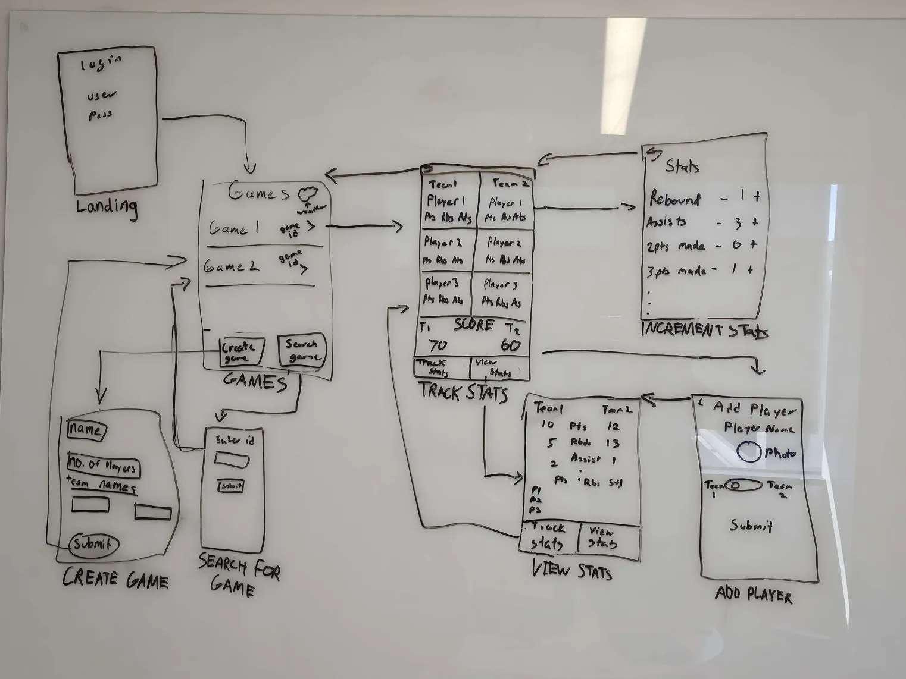
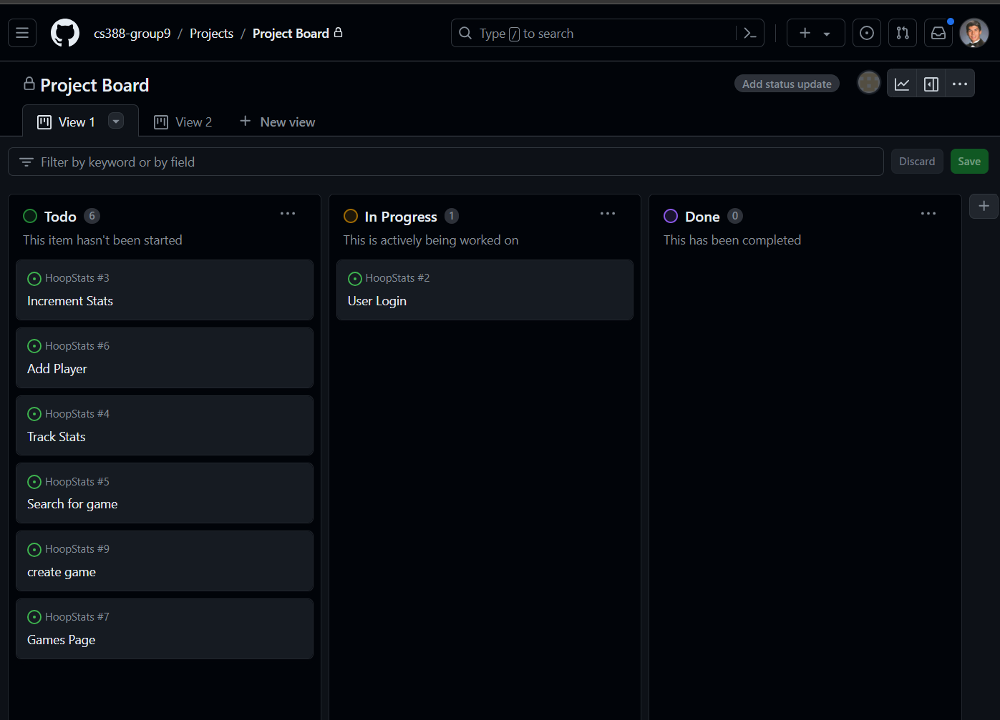

# Milestone 1 - HoopStats (Unit 7)

## Table of Contents

1. [Overview](#Overview)
1. [Product Spec](#Product-Spec)
1. [Wireframes](#Wireframes)

## Overview

### Description

Our app allows users to keep track of, and view player stats in their basketball games.

### App Evaluation

- **Category:** Sports
- **Mobile:**
    - Users can easily user their cameras to upload a profile photo of themselves
    - Push notifications for game updates and scores
    - Users will be able to access a live game chat to view play-by-play commentary of the game
- **Story:**
    - This app is valuable to anyone who plays pickup basketball.
    - I have many friends who get together to play basketball, so they would love to get a chance to use it
- **Market:**
    - Many people across the country play basketball. They are all potential users of the app
    - This app is specifically for people who play basketball.
- **Habit:**
    - This app would be used whenever a user and his friends play a game of basketball, or whenever someone wishes to look at stats from old games
    - a person watching would be creating the game, and the players would view the stats from their own devices after the game.
- **Scope:**
    - The app will incorporate features we learned in class. We will put them all together with a few extra features we have to teach ourselves. It can be done by the deadline
    - we have a clear plan of what we want to build for this app

## Product Spec

### 1. User Features (Required and Optional)

**Required Features**

1. User can create or a game or join a game another user has created
2. user login 
3. users can track stats during a game for each player
4. users can view team and player stats for games.

**Optional Features**

1. Integration with a weather API to display weather forecast in location

2. Live game chat for play commentary

3. Integration with camera and media upload photos

4. Push Notifications

### 2. Screen Archetypes

- [Landing screen]
  User can login on this screen, to load their account
- [Games Screen]
  User is able to view and select from the list of games in their account
  User can click create or add an existing game
  User can click the weather button to see a forecast
- [Create Game Screen]
  User is able to enter basic information to create the game
- [Search Game Screen]
  User is able to search for an existing game in the database with a unique id, to have access
- [Track Stats Screen]
  User can see team names and players stats
  User can click on player names to change their specific stats
- [View Stats Screen]
  User can only view stats here, with more information about the game and players
- [Increment Stats Screen]
  Users with access may increment or decrement each of the stats of a certain player to update
- [Add Player Screen]
  User enters basic information to create a player and add them to the game
### 3. Navigation

**Tab Navigation** (Tab to Screen)

* [Home tab]
* [Games tab]
* [Stats tab]

**Flow Navigation** (Screen to Screen)

- [Home]
  - [Landing screen 
      - If the user is logged in, direct them to the Games screen 
      - If not, prompt them to log in]

  - [Games screen
      - Create Game Screen 
      - Search Game Screen]
  
- [Games]
  - [Games Screen 
      - Create Game Screen 
      - Search Game Screen 
      - Track Stats Screen]
- [Stats]
  - [Track Stats Screen 
      - Increment Stats Screen 
      - Add Player Screen ]
    -[View Stats Screen]

## Wireframes

 

 

 

### [BONUS] Digital Wireframes & Mockups

### [BONUS] Interactive Prototype

 

# Milestone 2 - Build Sprint 1 (Unit 8)

## GitHub Project board

[Add screenshot of your Project Board with three milestones visible in
this section]

## Issue cards

- [Add screenshot of your Project Board with the issues that you've been working on for this unit's milestone] 
- [Add screenshot of your Project Board with the issues that you're working on in the **NEXT sprint**. It should include issues for next unit with assigned owners.] 

## Issues worked on this sprint

- List the issues you completed this sprint
- [Add giphy that shows current build progress for Milestone 2. Note: We will be looking for progression of work between Milestone 2 and 3. Make sure your giphys are not duplicated and clearly show the change from Sprint 1 to 2.]

 

# Milestone 3 - Build Sprint 2 (Unit 9)

## GitHub Project board

[Add screenshot of your Project Board with the updated status of issues for Milestone 3. Note that these should include the updated issues you worked on for this sprint and not be a duplicate of Milestone 2 Project board.] 

## Completed user stories

- List the completed user stories from this unit
- List any pending user stories / any user stories you decided to cut
from the original requirements

[Add video/gif of your current application that shows build progress]

## App Demo Video

- Embed the YouTube/Vimeo link of your Completed Demo Day prep video
